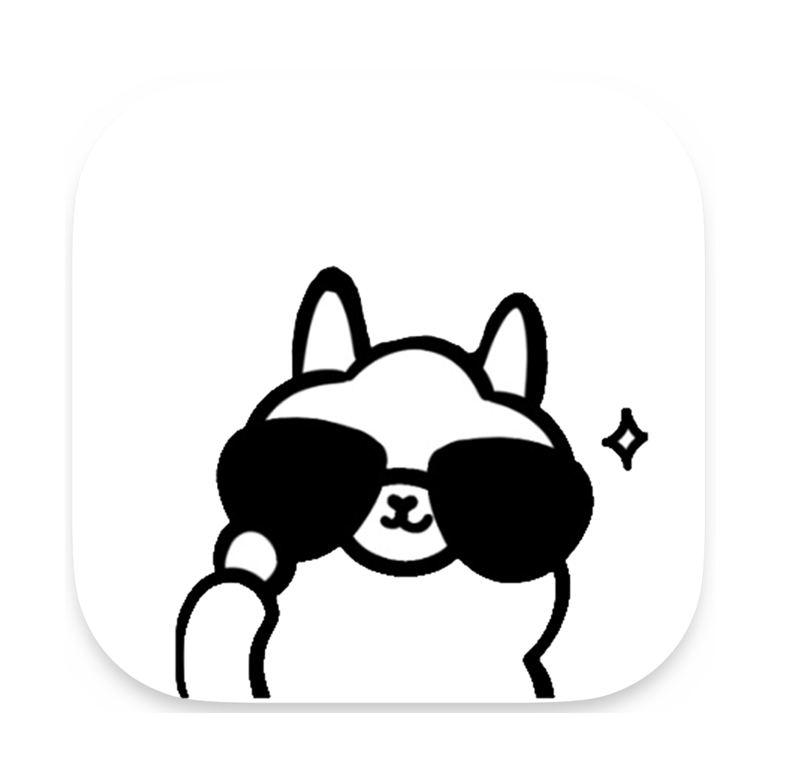

 

  
  <h2 align="center" style="font-weight: 600">Ollama—phone</h2>

  

    chat wtih ollama models
     
    <a href="" target="blank"><strong>macos</strong></a>&nbsp;&nbsp;|&nbsp;&nbsp;
    <a href="https://github.com/TaterTotX/ollama-phone/releases/download/Ollama-Phonev1.0.0/ollama-phone.exe" target="blank"><strong>windows</strong></a>&nbsp;&nbsp;|&nbsp;&nbsp;
    <a href="https://discord.gg/bkVQsAgG" target="blank"><strong>discord</strong></a>
     
     
  

A desktop iPhone_ui design that supports conversational chat with models within Ollma as if they were friends, with customizable roles. 

## ✨ characteristic

- 😋 Using Vue.js with Golang in the Wails framework for development.
- 🤠 Supports customizable chat backgrounds and character avatars.
- 🥰 Supports all large models supported by Ollama.
- 🥳 Supports customizable prompts and opening dialogues, enabling role-playing games.
- 🚫 Free of any advertisements and social features.

## ✨ User Guide
>1.Download Ollama from https://ollama.com/.
>
>2.Use Ollama to download a model you're interested in
>
>3.Open Ollama Phone, click 🍩, enter the model name, and save
> 
>4.Restart the software to apply the configuration, and start chatting~

## 📜 Open Source License

This project is for personal learning and research use only, and is prohibited for commercial and illegal purposes.

Based on the [MIT license](https://opensource.org/licenses/MIT) for open source.

## ☑️ Todo

Welcome to submit Issues and Pull Requests.

### Todo List
- [ ] Integrate voice functionality.
- [ ] Integrate local device software control functionality.
- [ ] Integrate online API functionality.

